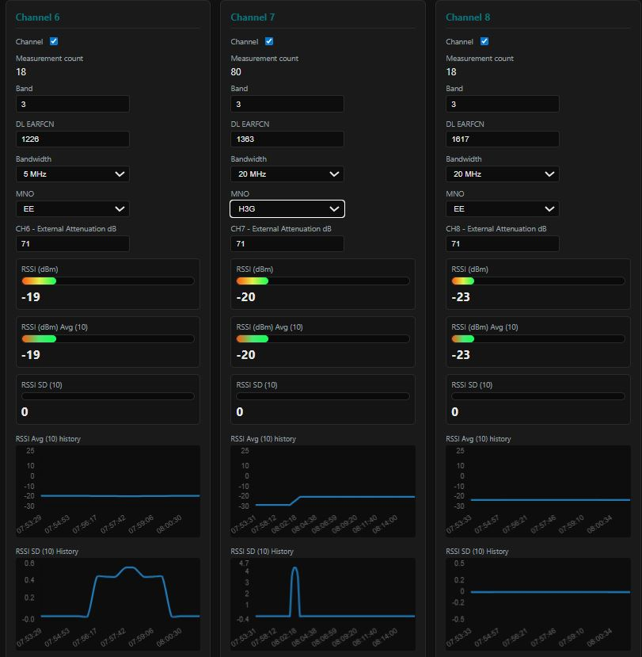

# Multi-Channel LTE (4G) Downlink Signal Power Monitor



**Version:** 1.0 beta  

**Scope:** This build targets **LTE (4G)** only—**E-UTRA** downlink factory test mode (`AT+QRXFTM` / `AT+QRFTESTMODE`). It is **not** aimed at NR (5G) stacks.

This repository is a small stack for RF / modem bench work. The active web app is a **FastAPI** dashboard under `dashboard/` that talks to a Quectel modem over serial (or a mock for UI development), syncs layout from `flows.json`, and pushes live state over WebSockets.

There is also **Node-RED** related material (`flows.json`, `package.json`, `node_modules/`) used as reference or exported flows; day-to-day local development is usually the Python dashboard only.

## Prerequisites

- **Python 3.10+** (3.11+ recommended)
- A **serial port** and Quectel modem when not using mock mode (Windows: e.g. `COM60`)

### Tested hardware / drivers

This project has been tested on a **Quectel EC25** modem on **Windows**, using **Waveshare** USB drivers for the USB–serial link. Other Quectel modules and host OSes may work if the serial port enumerates correctly and AT commands behave as expected.

- **[Waveshare EG25-G mPCIe wiki](https://www.waveshare.com/wiki/EG25-G_mPCIe)** — board/module page and driver notes.

The modem is operated in **factory RF test mode** (Quectel test commands such as `AT+QRFTESTMODE` / `AT+QRXFTM`) **without a SIM card**—downlink power is measured via the test/measurement path, not via normal network registration.

### RF path and power levels (DAS / repeater)

The reference bench setup uses a **large fixed RF power attenuator** between the **DAS or repeater downlink output** (levels up to about **+25 dBm**) and the EC25 measurement path, so the modem sees safe in-band power. **Displayed measurements are offset in software** to account for this: per-channel **attenuation** in the UI plus **per-band calibration** (built-in defaults in `dashboard/app/ec25_calibration.py`, overridable per band in **Settings**) are applied to raw `+QRXFTM` RSSI so reported dBm matches the intended reference (after the fixed front-end). If your splitter, cabling, or attenuator differs from that design, adjust per-channel attenuation and/or the band table in **Settings** so totals stay correct.

## Setup

1. **Clone** this repo (or copy it) so the layout stays:

   ```bash
   git clone https://github.com/Cloolalang/Multi-Channel-Cellular-downlink-signal-power-monitor.git
   cd Multi-Channel-Cellular-downlink-signal-power-monitor
   ```

   - `flows.json` at the **repository root**
   - `dashboard/` next to it (the app resolves `flows.json` relative to that folder)

2. **Create a virtual environment** (recommended):

   ```powershell
   cd dashboard
   python -m venv .venv
   .\.venv\Scripts\Activate.ps1
   ```

   On Linux or macOS:

   ```bash
   cd dashboard
   python3 -m venv .venv
   source .venv/bin/activate
   ```

3. **Install dependencies**:

   ```bash
   pip install -r requirements.txt
   ```

4. **Optional — environment file**  
   Create `dashboard/.env` if you want to override defaults. All variables use the prefix **`PT_`** (see table below). Pydantic loads `.env` from the **current working directory** when you start the app, so run Uvicorn from `dashboard/` as shown below.

## Configuration (`PT_*`)

| Variable | Default | Notes |
|----------|---------|--------|
| `PT_SERIAL_PORT` | `COM60` | Serial device (e.g. `/dev/ttyUSB0` on Linux) |
| `PT_BAUDRATE` | `115200` | Modem baud rate |
| `PT_MOCK_MODEM` | `false` | Set `true` for UI work without hardware (synthetic RSSI, fake OK on TX) |
| `PT_WS_PUSH_HZ` | `4` | WebSocket snapshot cadence (Hz) |
| `PT_RSSI_SMOOTH_SAMPLES` | `5` | Rolling window (samples) for per-channel RSSI avg/SD gauges and charts (1–64) |
| `PT_COMPOSITE_SMOOTH_SAMPLES` | `10` | Rolling window over composite dBm for composite avg/SD and charts (1–512) |
| `PT_SCAN_CHANNEL_DELAY_SEC` | `1` | Delay between `AT+QRXFTM` per channel on real serial (0 = no pause; may miss RSSI) |
| `PT_SCAN_ROUND_DELAY_SEC` | `0` | Pause after each full channel round before the next |
| `PT_MODEM_PREP_QRFTESTMODE` | `true` | Run `AT+QRFTESTMODE` prep after opening the port |
| `PT_MODEM_PREP_DELAY_SEC` | `2` | Delay used in that prep sequence |
| `PT_MODEM_QRXFTM_SCAN` | `true` | Continuous round-robin `AT+QRXFTM` per enabled channel |
| `PT_FLOWS_JSON` | *(auto)* | Override path to `flows.json` if needed |

Environment values are merged at startup; **`dashboard/dashboard_config.json`** (written from the **Settings** tab) overrides connection and UI/runtime tuning for that install and is **reloaded on every app restart**.  
`PT_MOCK_MODEM` is **environment/CLI only** (not persisted by the dashboard settings file).

### Settings tab (`dashboard_config.json`)

Open **Settings** in the UI to configure:

- **Serial:** COM port and baud (changing either **reopens** the serial port).
- **Timing:** scan delays, WebSocket push rate.
- **Smoothing:** per-channel RSSI window and composite power window (samples).
- **Gauge scale:** min/max dBm and optional segment breakpoints for the bar gauges (same scale as charts use for Y-axis alignment).
- **Band → external attenuation (dB):** per E-UTRA band map stored as `band_attenuation_db`; overrides built-in EC25 defaults for listed bands.
- **MNO Common preset:** per-channel band, EARFCN, bandwidth, MNO—stored as `mno_common_preset`; when present, overrides the MNO Common block from `flows.json` for startup and **Pre-load MNO Common**.
- **Channel bandwidth options:** `1.4`, `3`, `5`, `10`, `15`, `20` MHz in the per-channel dropdowns and in the Settings MNO Common table.

Use **Save** to write `dashboard_config.json`. **Pre-load MNO Common** on the dashboard applies the saved (or flows-derived) preset without restarting.

For `AT+QRXFTM` bandwidth mapping, the app uses Quectel index values:
`1.4→0`, `3→1`, `5→2`, `10→3`, `15→4`, `20→5`.

**UX notes:** Turning a **channel off** clears that channel’s gauges and charts until it is enabled again. **Composite** power combines linear power from **enabled** channels only.

**Scan LEDs:** Beside each **Channel n** title, a small round indicator shows scan activity. **Black** = idle for that channel; **bright green** = active step—either the channel visited in the `AT+QRXFTM` round-robin or (on hardware) the channel at the front of the pending `+QRXFTM` queue. If **`PT_MODEM_QRXFTM_SCAN=false`** and **`PT_MOCK_MODEM=true`**, the green highlight rotates through **enabled** channels on the UI tick. Live state is in the WebSocket snapshot under `controls.scan_active_channel` (and `controls.modem_qrxftm_scan` mirrors the env flag).

## Run the dashboard

From **`dashboard/`**:

```bash
uvicorn app.main:app --reload
```

Then open **http://127.0.0.1:8000** in a browser.

For LAN access, bind explicitly:

```bash
uvicorn app.main:app --reload --host 0.0.0.0 --port 8000
```

**Quick start without hardware:**

```bash
set PT_MOCK_MODEM=true
uvicorn app.main:app --reload
```

(PowerShell: `$env:PT_MOCK_MODEM="true"`)

## Project layout (short)

| Path | Role |
|------|------|
| `dashboard/app/` | FastAPI app, templates, static assets, serial worker |
| `flows.json` | Widget / flow metadata consumed by the dashboard |
| `dashboard/dashboard_config.json` | Local UI/settings persistence (gitignored) |

## Quectel documentation (references)

Serial commands used here (`AT+QRFTESTMODE`, `AT+QRXFTM`, and related FTM behaviour) are defined in Quectel’s factory-test documentation for **EC2x / EGxx**-class modules. A key reference is:

- **Quectel_EC2x&EGxx_FTM_AT_Commands_Manual_V1.0_Preliminary_20190404.pdf** (filename may show a browser suffix such as `(3).pdf` if downloaded multiple times)—**FTM AT Commands Manual**, preliminary **2019-04-04**.
- **[Quectel EC2x/EG9x/EG2x-G/EM05 AT Commands Manual V2.0 (Waveshare mirror PDF)](https://files.waveshare.com/wiki/EG25-G-mPCIe/Quectel-EC2x%26EG9x%26EG2x-G%26EM05-Series-AT-Commands-Manual-V2.0.pdf)** — general AT command reference for this module family.

For the same command set and updated PDFs, use Quectel’s official sources (registration / login is often required):

- **[Quectel Download Zone](https://www.quectel.com/download-zone)** — search for *FTM*, *AT Commands*, and your module (e.g. **EC25**), and download the current **FTM AT Commands Manual**, **AT Commands Manual**, and any **RF FTM** / application notes for your firmware line.
- **[RF FTM Application Note V1.0](https://www.quectel.com/download/quectel_ec2xeg2xeg9xem05_series_rf_ftm_application_note_v1-0)** (EC2x / EG2x / EG9x / EM05 series)—context on RF factory test mode (PDF behind login).
- **[LTE EC25 series](https://www.quectel.com/product/lte-ec25-series/)** — product page and linked documentation.

Always treat the **revision dated for your module firmware** as authoritative if it differs from older preliminary PDFs.

## TODO

- Explore hosting the dashboard/service on a **Teltonika RUT951** and connecting a **separate EC25** dedicated to factory-test/FTM measurements (to avoid interfering with the router’s primary cellular modem behavior).
- Add **GSM** capability (in addition to LTE/4G-only scope).
- Add an **EARFCN band scanner / spectrum view** mode that steps across a selectable EARFCN range, captures RSSI per step, and plots a frequency-domain chart.
- Add **external calibration correction factors** for **channel bandwidth** (BW-dependent correction).
